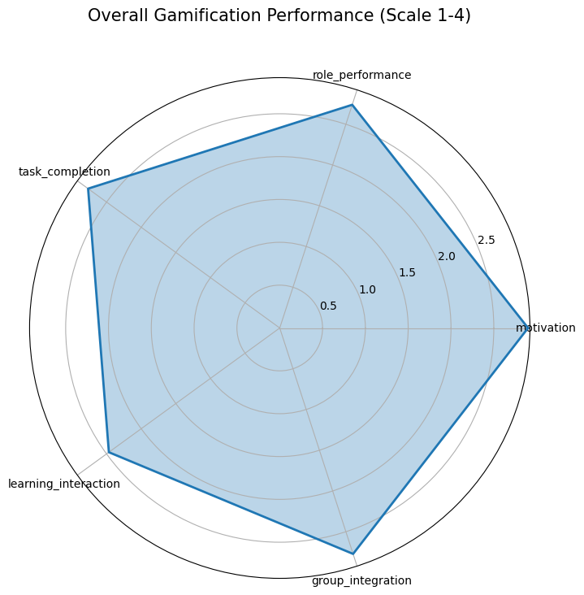
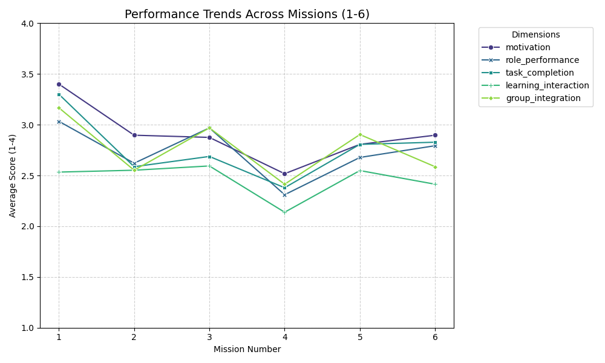
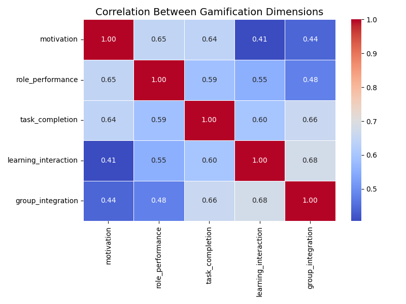

# Analysis of Teaching-Learning Gamification Strategies

[](https://creativecommons.org/licenses/by/4.0/)

This repository contains an exploratory data analysis (EDA) and visualization of gamification's impact on educational processes.

##  Teaching-Learning Gamification Analysis

> **Live Demo:** [Click here to explore the interactive dashboard](https://gamification-learning-analysis-f26dhqkhlrra7gkgl5rzx4.streamlit.app/)

##  Project Overview

##  About the Dataset
The dataset compiles quantitative and qualitative information on gamification strategies, focusing on student motivation, role performance, and collaborative dynamics.

- **Source:** [Mendeley Data](https://data.mendeley.com/datasets/yc4np572zs/1)
- **Institution:** Universidad de Las Americas
- **Contributors:** Patricia Acosta-Vargas, Cristian Uchima-Marin, Luis Salvador-Acosta

## Recent Updates
- **Automated Data Pipeline:** Developed `src/data_cleaning.py` to handle raw Excel files.
- **Numerical Mapping:** Standardized categorical Spanish evaluations into a 1-4 numerical scale.
- **Professional Refactoring:** Organized the workspace into a standard data science project structure.

##  Repository Structure

```text
gamification-learning-analysis/
├── data/
│   ├── raw/                # Original Excel datasets from Mendeley Data
│   └── processed/          # Cleaned and numerically transformed CSV files
├── src/
│   └── data_cleaning.py    # Python script for data preprocessing and mapping
├── .gitignore              # Prevents tracking of venv and cache files
├── LICENSE                 # CC BY 4.0 License
└── README.md               # Project documentation
```

### Translation & Standardization
To ensure global accessibility and ease of coding, all Spanish headers and categorical values have been mapped to English equivalents.
- **Source Language:** Spanish (ES)
- **Target Language:** English (EN)

### Qualitative to Quantitative Conversion
Student evaluations were originally recorded as categorical feedback. These have been transformed into a numerical scale to enable statistical analysis and multidimensional profiling:

| Qualitative Level (ES) | Qualitative Level (EN) | Numerical Value |
|:-----------------------|:-----------------------|:---------------:|
| **BAJO** | Low                    | **1** |
| **BÁSICO** | Basic                  | **2** |
| **ALTO** | High                   | **3** |
| **SUPERIOR** | Superior               | **4** |

##  Evaluation Metrics
The analysis focuses on 5 core dimensions:
1. **Group Motivation** (Engagement levels)
2. **Role Performance** (How well roles are adopted)
3. **Task Completion** (Timeliness and quality)
4. **Learning & Interaction** (Knowledge sharing)
5. **Group Integration** (Harmony and conflict resolution)

##  Analysis & Methodology
- Conversion of qualitative scales (Low, Basic, High, Superior) to numerical values (1-4).
- Descriptive statistics and multidimensional radar profiling.

## Visual Analysis Results
The following charts represent the quantitative analysis of the gamification process based on the processed dataset.

### 1. Overall Performance Profile (Radar Chart)
The radar chart illustrates the balance between different dimensions. **Motivation** stands out as the primary driver of the strategy, with all metrics maintaining a healthy average above 2.5 on a 1-4 scale.



### 2. Performance Trends (Mission 1 to 6)
The trend analysis shows a strong start (Mission 1), followed by a notable dip in Mission 4, likely due to increased task complexity. However, a consistent recovery is observed in Missions 5 and 6, showing student resilience and adaptation.



### 3. Dimensional Correlations (Heatmap)
The correlation heatmap clarifies the mathematical relationship between different evaluation metrics. Statistical correlation confirms that **Group Integration** is the primary driver for **Learning Interaction** (0.68). Interestingly, while **Motivation** strongly impacts **Role Performance** (0.65), its direct influence on group interaction is more moderate (0.41).



##  Interactive Dashboard
An interactive web dashboard has been developed using **Streamlit** and **Plotly** to allow for dynamic exploration of the gamification data.

### Features
- **Dynamic Filtering:** Filter results by specific Missions (1-6).
- **Interactive Radar Chart:** View overall performance dimensions for selected missions.
- **Trend Analysis:** Track performance evolution with interactive line charts.
- **Data Preview:** Access and filter the processed dataset directly.

### How to Run Locally
To run the dashboard on your local machine, follow these steps:
1. Navigate to the project directory.
2. Ensure dependencies are installed (see requirements.txt).
3. Execute the following command:
   ```bash
   streamlit run src/app.py

##  Citation
If you use this project, please cite the original dataset:
> Acosta-Vargas, Patricia; Uchima-Marin, Cristian; Salvador-Acosta, Luis (2025), “Dataset on Teaching-Learning Gamification”, Mendeley Data, V1, doi: 10.17632/yc4np572zs.1
